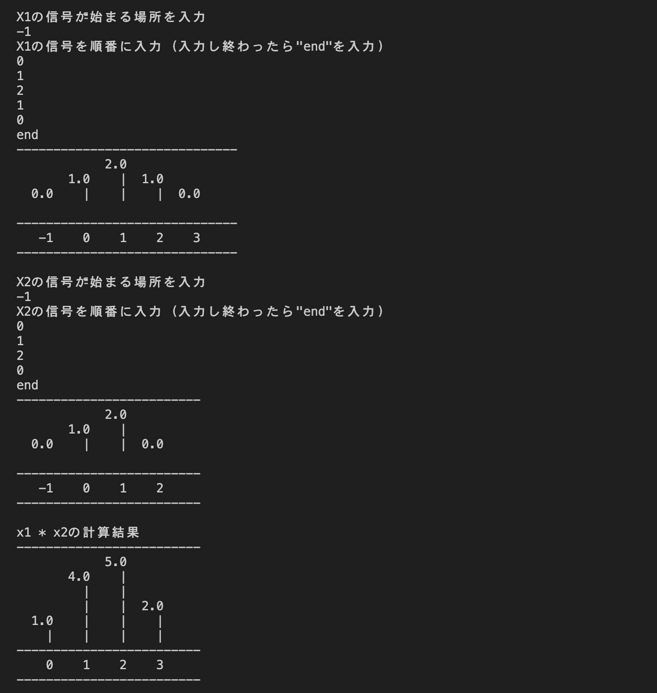

# ConvolutionApp
離散信号の畳み込みの計算を行うプログラム 
グラフ出力にも対応 
 
あらゆる信号の演算が可能 
信号の長さや、信号が始まるnの場所は自由 
 
信号の値も自由自在 
マイナスの値や、小数点付きの値でも計算可能 
 
Normalize機能搭載 
無駄な0が続く信号のデータ量を少なくできる 

# 実行結果
 

# コンパイル方法
Makefileを導入した状態で`make`を実行 
フォルダ内に追加されたソースファイルが自動的にコンパイルされるようになっている 

# ライセンス
<a href="LICENSE" target="_blank" rel="noopener noreferrer">MIT License</a> 
何か変更したい点などあればご連絡ください
